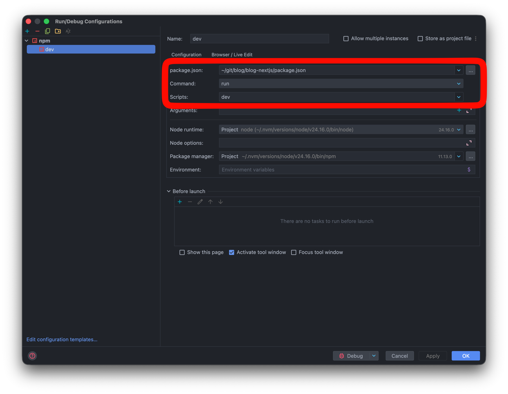

# Next.js (Turbopack) 디버깅 가이드

IntelliJ에서 Next.js 16(Turbopack) 개발 서버의 서버/클라이언트 코드를 디버깅하는 방법을 정리한다.

## 프로세스와 포트 구조

`next dev`는 CLI(부모)와 서버(자식) 프로세스 2개로 뜬다. `next dev --inspect` 플래그를 쓰면 인스펙터가 **서버 프로세스에 직접** 열리며, 기동 로그의 `Debugger port:` 라인이 그 포트를 알려준다(기본 9229). 디버거는 항상 이 포트에 붙인다.

```
▲ Next.js 16.2.10 (Turbopack)
- Local:         http://localhost:3000
- Debugger port: 9229        ← attach 대상
```

Turbopack은 번들링만 Rust로 수행할 뿐 앱 코드는 여전히 Node.js에서 실행되므로, 디버깅 방식은 "Node 인스펙터에 attach"로 동일하다.

## 사전 준비: dev 스크립트

`package.json`의 dev 스크립트는 Next.js 16의 공식 CLI 플래그를 사용한다.

```json
"dev": "next dev --inspect"
```

> **주의:** `cross-env NODE_OPTIONS='--inspect' next dev` 방식을 쓰면 안 된다.
> - IntelliJ가 Debug 실행 시 `NODE_OPTIONS`에 주입하는 디버거 연결 코드를 덮어써서 브레이크포인트가 잡히지 않는다.
> - 인스펙터가 부모(9229)/서버(9230) 두 포트로 갈라져 attach 대상이 헷갈린다. `--inspect` 플래그는 서버 프로세스 하나(9229)에만 열린다.
>
> 기동 시 `Starting inspector ... address already in use` 로그가 한두 줄 보일 수 있는데, 내부 워커 프로세스가 남기는 무해한 메시지다.

## 1. 서버 사이드 디버깅 — npm 설정 + Debug 버튼 (권장)

`Run → Edit Configurations → + → npm`으로 아래와 같이 설정한다.



| 필드 | 값 |
|---|---|
| Name | `dev` |
| package.json | `blog-nextjs/package.json` 선택 |
| Command | `run` |
| Scripts | `dev` |
| Arguments | 비움 |
| Node runtime | 기본값 (Project node) |
| Node options | **비움** |
| Package manager | 기본값 |
| Environment | 비움 |

**Debug(벌레 아이콘)** 로 실행하면 IntelliJ가 서버 프로세스에 자동으로 attach한다. `getServerSideProps`, API 라우트 등 서버 코드에 브레이크포인트를 걸면 바로 동작한다.

## 2. 터미널에서 띄운 서버에 붙기 — Attach to Node.js/Chrome

터미널에서 `npm run dev`로 실행한 서버에 나중에 디버거를 붙일 때 사용한다.

1. 서버 기동 로그에서 포트 확인: `Debugger port: 9229`
2. `Run → Edit Configurations → + → Attach to Node.js/Chrome`
   - Host: `localhost`, Port: `9229`
   - **Reconnect automatically** 체크 (서버 재시작 시 자동 재연결)
3. 이 설정을 Debug로 실행

## 3. 클라이언트 사이드 디버깅 — JavaScript Debug

브라우저에서 실행되는 React 컴포넌트 코드를 디버깅할 때 사용한다.

1. `Run → Edit Configurations → + → JavaScript Debug`
   - URL: `http://localhost:3000`
2. dev 서버가 떠 있는 상태에서 이 설정을 Debug로 실행하면 디버거가 연결된 크롬이 열린다.

Turbopack이 소스맵을 자동 제공하므로 추가 설정은 필요 없다.

## 트러블슈팅

| 증상 | 원인 / 해결 |
|---|---|
| 서버 코드 브레이크포인트가 안 잡힘 | dev 스크립트가 `NODE_OPTIONS`를 덮어쓰는지 확인. `next dev --inspect` 형태여야 한다. |
| Attach 시 연결은 되는데 멈추지 않음 | 잘못된 포트에 붙은 경우. `Debugger port:`에 출력된 포트로 붙었는지 확인한다. `curl http://127.0.0.1:9229/json`으로 attach 대상이 `next/dist/server/lib/start-server.js`(서버 프로세스)인지 확인할 수 있다. |
| 포트가 9229가 아님 | 9229가 이미 사용 중이면 다른 포트로 밀릴 수 있다. 항상 기동 로그의 `Debugger port:` 값을 따른다. |
